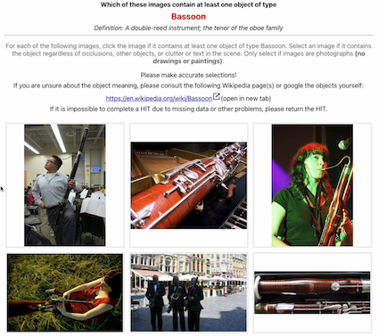
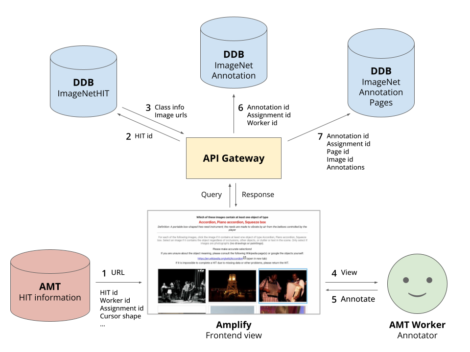
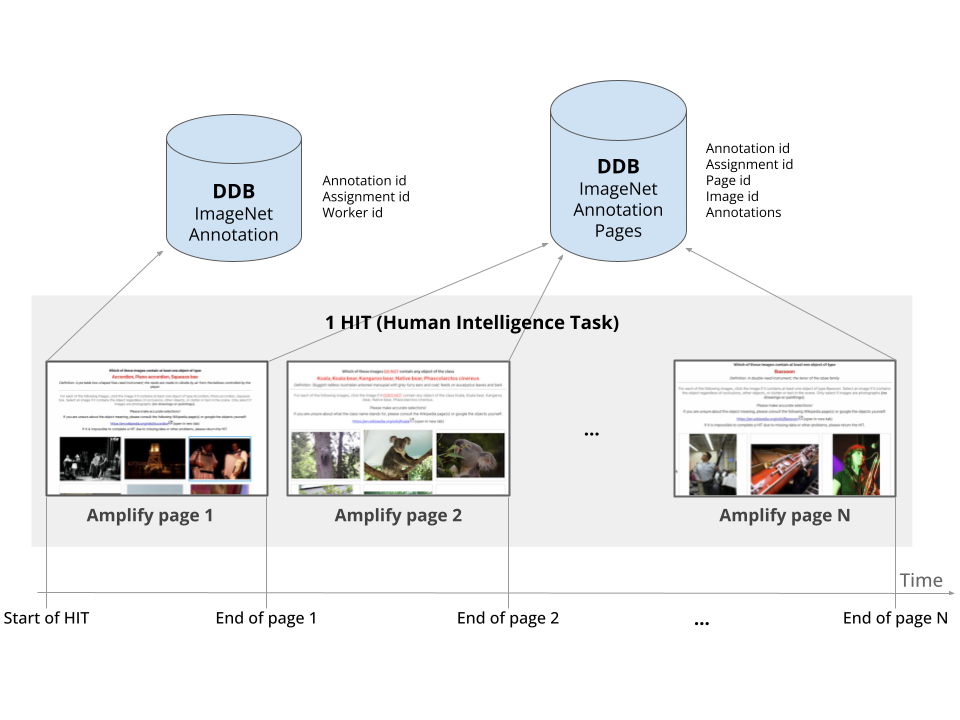

# ImageNet Annotation Tool - Frontend (FE) ([ICCV'23 Paper](https://arxiv.org/abs/2303.17595))

[ImageNet](https://image-net.org/) is an iconic training and benchmarking dataset in computer vision. 
Not only did it set a standard as a computer vision dataset, but it has opened the era of large-scale annotations.
The annotation tool is the product of careful design choices on the elements that facilitate faster and more precise class labels based on crowdsourced annotators from [Amazon Mechanical Turk](https://www.mturk.com/) (AMT or MTurk).
ImageNet class annotations are collected following the "browsing" interface, where annotators make a batch of yes/no decisions for a set of candidate images for the class of interest.

Yet, the annotation tool for ImageNet has not been open-sourced, as far as we are aware.
This repository contains the open-sourced frontend (FE) modules for ImageNet annotation. Our FE is a reproduction of the original interface.
More precisely, we have replicated the FE interface for [ImageNetV2](https://github.com/modestyachts/ImageNetV2) frontend, which is a careful and faithful reproduction of the original interface.
We had to rely on this double-replication due to the unavailability of the original ImageNet interface.

This replicated annotation system has been used for the [**Neglected Free Lunch**](https://github.com/naver-ai/NeglectedFreeLunch) project, published as an [ICCV'23 Paper](https://arxiv.org/abs/2303.17595).

> Warning: The full annotation system works only when the backend is set up, which we do not support. 
> However, the repository contains sufficient information for configuring the BE on your own.


## Example view of the FE interface

Watch the videos below for an idea of how the interface works. For each page of the human intelligence task (HIT), the object class of interest is declared and described at the top. The worker is required to click on all the images containing the objects of the class. The worker then clicks the "Submit" button which will load the next page. Two mouse pointer types are available: 

- Original () 
- Red Pointer ()

Type | Original Interface () |  Interface with Red Pointer ()
:--:|:-------------------------:|:-------------------------:
Video (Youtube) | <a href="https://youtu.be/Fo_ewL9K4e0" title="ImageNet-Original"></a> |  <a href="https://youtu.be/AAoFT9xjI58" title="ImageNet-Red-Pointer"></a>
URL | `?VERSION=NO_POINTER_ORIGINAL` | `?VERSION=POINTER_ORIGINAL`

## What are being recorded?

For each candidate image, we record the following data structure. The data collected are much richer than the ImageNet annotations themselves. For example, our FE collects the time series of annotators' interactions with the images on the FE page. It also contains information about the position of each image in the page and the AMT worker.

```json
{
  "imageID": "n01440764/n01440764_105", 
  "originalImageHeight": 375, 
  "originalImageWidth": 500, 
  "imageHeight": 243, 
  "imageWidth": 243,
  "imagePosition": {"x": 857, "y": 1976},
  "hoveredRecord": [
    {"action": "enter", "time": 1641425051975},
    {"action": "leave", "time": 1641425052740}
  ],
  "mouseTracking": [
    {"x": 0.0030864197530864196, "y": 0.629629629629629, "time": 1641425051975},
    {"x": 0.44135802469135804, "y": 0.6008230452674898, "time": 1641425052027}
  ],
  "selected": true,
  "selectedRecord": [
      {"x": 0.5401234567901234, "y": 0.4732510288065844, "time": 1641425052319}
  ],
  "worker_id": "47DBDD543E"
}
```
- `imageID`: ImageNet identifier
- `imageHeight`, `imageWidth`: Number of pixels in the FE page
- `imagePosition`: Position of the image in the FE page
- `hoveredRecord`: Time series of actions related to entering and leaving the image region
- `mouseTracking`: Trajectory of mouse cursor over the image region
- `selected`: Whether the image was eventually selected
- `selectedRecord`: Time series of clicking activities for the image
- `worker_id`: We STRONGLY SUGGEST to anonymise the workers AMT identifiers when utilising them in any form.

## Overall architecture



#### Overall architecture for our ImageNet Annotation tool

1. [Amazon Mechanical Turk](https://www.mturk.com/) (AMT) provides the Human Intelligence Task (HIT) identifiers for the current HIT via url (`?hitDatasetName=ABCDEF&imageNetHitId=abcdef012345`)
2. Through [API Gateway](https://aws.amazon.com/api-gateway/), the HIT identifiers are queried (`hitDatasetName` and `imageNetHitId`).
3. The responsible [DynamoDB](https://aws.amazon.com/dynamodb/) (DDB) table returns the necessary information for building the frontend view (object class information and image urls).
4. The AMT worker reads the class description and browses through the images.
5. The AMT worker clicks on the images that contain the class of interest.
6. (and 7.) The annotations are sent to the DDB tables (`ImageNetAnnotation` and `ImageNetAnnotationPages`).



#### Detailed update schedules for annotations across pages

- Each HIT consists of `N` pages of image selection tasks. We usually set `N=10`.
- Opening the Amplify page triggers the recording of basic information about the entire HIT on the `ImageNetAnnotation` table.
- Upon clicking on the `Submit` button on each page, the annotation data for the page are sent to the `ImageNetAnnotationPages` table.
- The `ImageNetAnnotation` and `ImageNetAnnotationPages` are associated through the Annotation ID column.


## Building the frontend

Run 

```bash
yarn install
yarn start
```

We have hosted the web page with [AWS Amplify](https://aws.amazon.com/amplify/) that has supported a CI/CD with the current repository.

## More on the backend

We do not support BE in this repository. 
If you wish to actually build the whole architecture, you will need to configure the BE resources by yourself.

For your information, below is the list of BE resources we have used for the overall system.

| Category | AWS Type    | Resource Name         | Description                                                                                                                                                  |
| -------- | ----------- |-----------------------|--------------------------------------------------------------------------------------------------------------------------------------------------------------|
| Function | [Lambda](https://aws.amazon.com/lambda/)      | `ImageNetAPI`         | Functions for reading and writing on the DynamoDB Tables.                                                                                                    |
| Api      | [API Gateway](https://aws.amazon.com/api-gateway/) | `ImageNetAPI`         | Routing for the `ImageNetAPI` functions.                                                                                                                     |
| Storage  | [DynamoDB](https://aws.amazon.com/dynamodb/)    | `ImageNetHIT`         | DB for MTurk tasks (grouping of images into HITs).                                                                                                           |
| Storage  | [DynamoDB](https://aws.amazon.com/dynamodb/)    | `ImageNetAnnotation`  | DB for annotations per HIT (=`N` pages of annotation tasks). It contains reference to `N` entries in the `ImageNetAnnotationPage` table. `N=10` in our case. |
| Storage  | [DynamoDB](https://aws.amazon.com/dynamodb/)    | `ImageNetAnnotationPage` | DB for annotations per page (=`M` candidate images for the same class). `M=48` in our case.                                                                  |

Sufficient information for configuring your own BE is given at:

- The interface for the API access from the FE to DynamoDB is available at [src/api/ImageNetAPI/*.ts](src/api/ImageNetAPI).
- The required list of columns and corresponding types for DynamoDB tables are available at [src/models/*.ts](src/models).

## Amazon Mechanical Turk (AMT or MTurk)

The above web page can be integrated into the ["Survey" tasks](https://blog.mturk.com/getting-started-with-surveys-on-mturk-e2eea524c73) supported by AMT. When workers choose to work on a "Survey" task, they enter a landing page designed by the HIT requesters. We use the HTML file [amt-question-form.html](amt-question-form.html) as the landing page. The page contains instructions as well as the url link to the Amplify page described above. The url is built automatically, given the requester-specified parameters: `toolLink`, `version`, `hitDatasetName`, and `imageNetHitId`. They are defined by the requester in batch through a [CSV database](https://blog.mturk.com/using-csv-files-to-create-multiple-hits-in-the-requester-ui-22a25ec563dc).

When annotations are completed, we use the [AMT API](https://docs.aws.amazon.com/AWSMechTurk/latest/AWSMturkAPI/Welcome.html) to read and match the workers' task submission status on the AMT server and the annotation data on our DDB tables. We assess the sanity of submitted work and make accept/reject decisions for the submissions through the [AMT API](https://docs.aws.amazon.com/AWSMechTurk/latest/AWSMturkAPI/Welcome.html).

## Acknowledgement

* [Dante @1000ship](https://github.com/1000ship) is an amazing engineer who did most of the work in this repository.
* [Seong Joon](https://seongjoonoh.com) was asking for more and more features in the meantime..
* This is the result of great discussions with the great HCI and AI researchers:
  * [Dongyoon](https://sites.google.com/site/dyhan0920/)
  * [Jean](https://jyskwon.github.io/)
  * [Junsuk](https://sites.google.com/site/junsukchoe/)
  * [John](https://johnr0.github.io/)
  * [Minsuk](https://minsukchang.com/)
  * [Sangdoo](https://sangdooyun.github.io/)
* and funding from 
  * [@Naver-AI](https://github.com/naver-ai)
  * [DGIST Intelligence Augmentation Group (DIAG)](https://diag.kr/). 
* We also thank the [ImageNetV2](https://github.com/modestyachts/ImageNetV2) authors ([Ludwig Schmidt](https://people.csail.mit.edu/ludwigs/), [Vaishaal Shankar](http://vaishaal.com/) and [Rebecca Roelofs](https://github.com/rolloff)) for their great paper and personal communications.

## License
```
MIT License

Copyright (c) 2022-present NAVER Corp.

Permission is hereby granted, free of charge, to any person obtaining a copy
of this software and associated documentation files (the "Software"), to deal
in the Software without restriction, including without limitation the rights
to use, copy, modify, merge, publish, distribute, sublicense, and/or sell
copies of the Software, and to permit persons to whom the Software is
furnished to do so, subject to the following conditions:

The above copyright notice and this permission notice shall be included in all
copies or substantial portions of the Software.

THE SOFTWARE IS PROVIDED "AS IS", WITHOUT WARRANTY OF ANY KIND, EXPRESS OR
IMPLIED, INCLUDING BUT NOT LIMITED TO THE WARRANTIES OF MERCHANTABILITY,
FITNESS FOR A PARTICULAR PURPOSE AND NONINFRINGEMENT. IN NO EVENT SHALL THE
AUTHORS OR COPYRIGHT HOLDERS BE LIABLE FOR ANY CLAIM, DAMAGES OR OTHER
LIABILITY, WHETHER IN AN ACTION OF CONTRACT, TORT OR OTHERWISE, ARISING FROM,
OUT OF OR IN CONNECTION WITH THE SOFTWARE OR THE USE OR OTHER DEALINGS IN THE
SOFTWARE.
```

## Citing our work

```
@inproceedings{han2023iccv,
  title = {Neglected Free Lunch – Learning Image Classifiers Using Annotation Byproducts},
  author = {Han, Dongyoon and Choe, Junsuk and Chun, Seonghyeok and Chung, John Joon Young and Chang, Minsuk and Yun, Sangdoo and Song, Jean Y. and Oh, Seong Joon},
  booktitle = {International Conference on Computer Vision (ICCV)},
  year = {2023}
}
```
